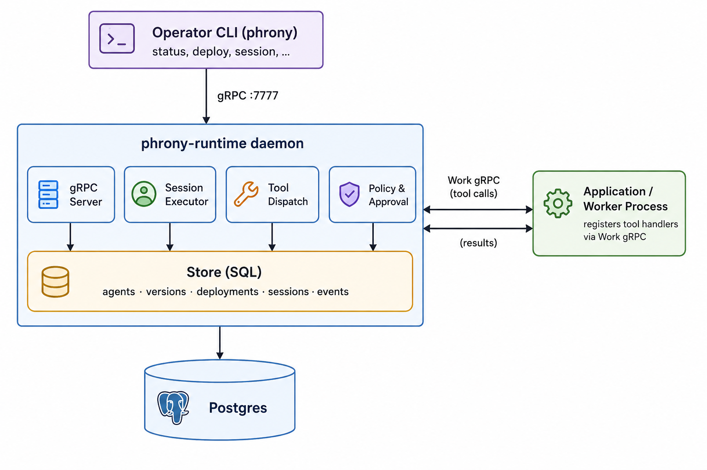

<p style="display: block; width: 100%; padding-top: 2rem; padding-bottom: 2rem;">
  <picture>
    <source srcset="assets/phrony-runtime-logo.png">
    
  </picture>
</p>

# Phrony Runtime

**Official open-source implementation of the Phrony Agent Spec runtime.**

## What is this?

The Phrony Runtime is a gRPC daemon that loads declared agent manifests, executes agent sessions (LLM loop, tool mediation, policies, approvals, and limits), emits structured traces, and returns results. Agents are declared in a YAML manifest (not embedded as application code), deployed to the runtime as versioned entities, and run by name. Applications register tool handlers over a bidirectional streaming protocol—the runtime mediates tool calls from the model to your handlers without the application managing the LLM loop itself.

## How it all fits together



**Components:**

| Binary | Role |
|--------|------|
| `phrony-runtime` | Daemon: migrations, gRPC server, deploy, session execution |
| `phrony` | Operator CLI: `status`, `session`, `deploy`, `validate` |

## Grab the tools

**You'll need:** Docker, Go 1.25+

```bash
go install github.com/phrony-platform/runtime/cmd/cli@latest
mv -f "$(go env GOPATH)/bin/cli" "$(go env GOPATH)/bin/phrony"
```

Or from a clone: `make install-cli` (installs to `~/.local/bin`).

## Run your first agent in 5 minutes

```bash
mkdir phrony-quickstart && cd phrony-quickstart

# 1. Start Postgres and the runtime daemon
curl -fsSLO https://phrony.com/runtime/docker-compose.yml
docker compose up -d --wait

# 2. Check the runtime is reachable
phrony status

# 3. Deploy an agent
phrony deploy path/to/agent.yaml

# 4. Run a session
phrony session <namespace>/<name>

# 5. Tear down
docker compose down
```

The runtime listens on `127.0.0.1:7777`. Override with `--runtime-addr` or `PHRONY_RUNTIME_ADDR`. See full reference below.

## Reference

### Environment variables

The [Compose file](https://phrony.com/runtime/docker-compose.yml) sets dev defaults for all variables below, so the quickstart needs no extra configuration.

| Variable | Used by | Description |
|----------|---------|-------------|
| `RUNTIME_DATABASE_URL` | `phrony-runtime` | Postgres connection string |
| `RUNTIME_GRPC_ADDR` | `phrony-runtime` | gRPC listen address (default `127.0.0.1:7777`; use `0.0.0.0:7777` inside Docker) |
| `RUNTIME_SECRETS_ENCRYPTION_KEY` | `phrony-runtime` | AES-256 master key for encrypting publish-time secrets (32 bytes, base64 or hex). Generate with `openssl rand -base64 32` |
| `RUNTIME_TOOL_ALLOWLIST` | `phrony-runtime` | Path to a YAML tool allowlist for dispatch-time integrity checks (optional) |
| `RUNTIME_DISPATCH_QUEUE_WAIT` | `phrony-runtime` | Max time a tool call may wait in the worker queue when no handler is free (default `10s`) |
| `RUNTIME_ENABLE_STUB_PROVIDER` | `phrony-runtime` | Dev-only: enable the scripted stub model provider (`true`, `1`, or `yes`) |
| `PHRONY_RUNTIME_ADDR` | `phrony` | Runtime gRPC endpoint (default `127.0.0.1:7777`) |
| `PHRONY_ACTOR` | `phrony` | Audit identity for publish, deploy, rollback (defaults to OS username) |
| `PHRONY_NO_TUI` | `phrony` | Disable interactive session TUI (plain stdout) |
| `NO_COLOR` | `phrony diff` | Disable colorized diff output |

Provider API keys referenced in manifest `secrets.*.fromEnv` (e.g. `ANTHROPIC_API_KEY`) are read on the machine running `phrony publish`, not on the runtime daemon.

## Development

To build from source: `make dev-up` (builds local `Dockerfile`) or `make serve` with Postgres from Compose. Run `make` without arguments for the full target list.

See [CONTRIBUTING.md](CONTRIBUTING.md) for repository layout, code style, and PR guidelines.
